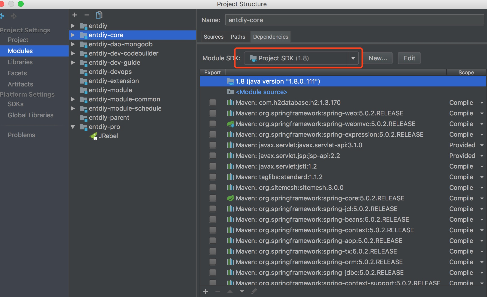

## 基本工具安装配置

### 特别说明

* 本框架开发在Mac OS系统下IntelliJ IDEA环境，相关说明或截图主要基于此环境，其他操作系统和IDE请注意必要参考调整。

### Oracle JDK 1.8+

框架一些组件已经升级使用最新版本，因此需要使用JDK 1.8+版本，同时由于框架使用了JCaptch验证码组件，但是这个组件依赖较早版本JDK的image jpeg相关API，
在新版本的OpenJDK已经移除，因此需要安装Oracle版本的JDK 1.8+版本（包含image jpeg相关API）才能正常启动和运行应用。

请自行访问Oracle官方站点下载安装Oracle JDK 1.8版本（1.9版本未验证，不确定兼容性，建议采用1.8版本）：
http://www.oracle.com/technetwork/java/javase/downloads/jdk8-downloads-2133151.html

可选择下载安装版本或解压缩版本，如果是解压缩版本，请确保正确设置 JAVA_HOME 环境变量，通过如下命令验证一下：

``` bash
#java -version
java version "1.8.0_XXX"
Java(TM) SE Runtime Environment (build 1.8.0_XXX)
Java HotSpot(TM) 64-Bit Server VM (build XXX, mixed mode)
```

``` bash
#echo $JAVA_HOME
${JDK_INSTALL}/jdk1.8.0_XXX
```

### Java IDE

项目采用标准的Maven结构，主流的Java IDE应该都可以使用，如IDEA/Eclipse/Spring Tool Suite。

### Apache Maven安装配置

目前框架和教程实际验证过的采用apache-maven-3.0.5版本，按照官方的说法 “This is a stable version 3.0.x of Maven for projects that can't upgrade to Maven 3.2 yet.” ，其他Maven版本可能存在的兼容性问题未知。

如果本地开发环境和IDE已经配置好maven环境，则沿用即可；如果没有，可以直接使用 entdiy-devops/entdiy-ops-docker/tools/maven，可按照实际情况修改 conf/settings.xml 中maven库本地目录：

```
<localRepository>/data/projects/tools/repository</localRepository>
```

### IDE插件安装配置
 
#### Lombok插件安装配置

实体对象属性定义采用了Lombok来简化繁琐的getter和setter定义，所以java源码层面就没有相关的getter和setter方法定义，因此需要安装Lombok的插件来实现自动化增强编译输出缺少的方法定义，否则整个工程会抛出编译错误。

请根据自己使用的IDE自行参考 https://projectlombok.org/setup/overview 安装插件。

#### IDE Workspace参数配置

* 编码设定为UTF-8

### 项目资源库获取说明

项目基于GIT进行代码托管，你可以基于熟悉的IDE Git插件或TortoiseGIT或SourceTree或其他GIT客户端工具等获取项目代码。以下基于STS已自带的git插件进行项目获取。

### 项目导入及开发环境配置

**重要提示：** 最好在上述Eclipse配置完成后再按照下述过程导入项目，避免不必要的环境配置问题导致编译异常。

项目采用标准的Maven结构，按照各IDE的project open或import maven project等功能，正常情况是能直接导入到IDE的工作空间并自动构建编译。

导入之后如果出现编译错误，请首先确认是否已正确安装Lombok插件和Maven配置。

对于IDEA，导入之后如果出现编译错误请检查一下各module确保如图所示配置好JDK8：



导入项目后IDE应该会自动触发项目构建，同时进行Maven依赖资源的下载，此过程依据你的网速情况可能需要持续数分钟到数十分钟。
在初始化自动构建完毕后，为了确保Maven执行的完整性，建议在命令行终端，cd 到 entdiy-webapp 执行 maven install 命令，查看整个构建过程全部success。

### Redis安装配置

框架全面使用Redis作为Spring Session缓存、Hibernate缓存等支持，因此必须安装配置Redis才能正常运行应用。

为了提供redis服务，可以采用如下两种方式：

* 如果你熟悉redis安装配置或已有现成的redis服务，可以直接修改entdiy-webapp/src/main/resources目录下
application.properties和hibernate-redisson.yaml两个配置文件中redis主机、端口、密码等相关参数。

* 直接使用框架提供的Docker Redis服务，详见 [Docker服务](220.Docker服务.md) 中redis相关说明部分。

### 项目部署到Server运行

整个项目编译构建完成后，按照各IDE的Java EE Server如Tomcat 8配置运行环境，然后把工程部署到开发Server。
选择Start启动服务，项目默认配置采用H2内存数据库，可以直接启动运行。
首次运行可能会在Console台看到一些SQL的drop语句或外键语句异常，可以暂时不用管。正常情况再次运行Server就没有这些SQL异常了。

Console台可以看到整个数据库结构及基础数据初始化过程，最后大致看到"FrameworkServlet 'springServlet': initialization completed in 13744 ms"则说明启动完毕。

打开浏览器，访问 http://localhost:8080/entdiy ，根据登录页面提示点击root登录链接即可进入管理端主界面。